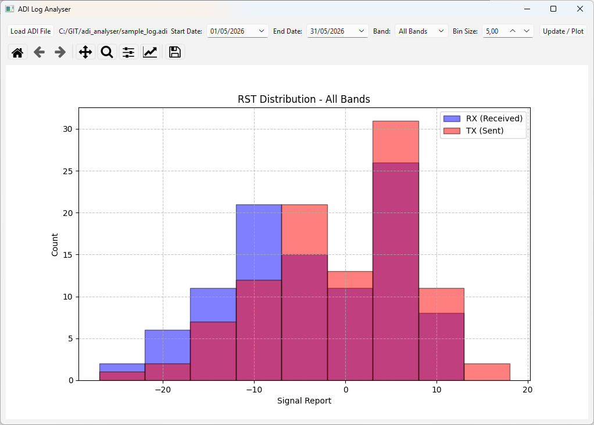

# ADI Log Analyzer

A graphical user interface (GUI) application for amateur radio operators to analyze and visualize radio station performance across different bands. This tool parses Amateur Data Interchange Format (ADIF) log files and generates signal report histograms to assess both receive (RX) and transmit (TX) performance.

## Overview

The ADI Log Analyzer is designed for radio enthusiasts who use digital modes (like WSJT-X) or traditional modes and want to understand their station's performance. It reads standard ADI log files, filters data by date and band, and creates comparative histograms of signal reports.

## Features

- **ADIF File Parsing**: Accurately reads and parses standard Amateur Data Interchange Format files
- **Data Filtering**: Filter QSO data by date range and radio band
- **Band Organization**: Automatic grouping of contacts by band (160m, 80m, 40m, 20m, 15m, 10m, 6m, 2m, 70cm, etc.)
- **Performance Visualization**: Generate histograms comparing RX (receive) and TX (transmit) signal reports
- **Configurable Analysis**: Adjust histogram bin sizes for best visualization
- **User-Friendly GUI**: PySide6-based interface for easy interaction

## Requirements

- Python 3.x
- PySide6
- pandas
- numpy
- matplotlib

## Installation

1. Clone or download this repository
2. Install dependencies:
   ```bash
   pip install -r requirements.txt
   ```

## Usage

Run the application:
```bash
python main.py
```

Then:
1. Click **"Load ADI File"** to open your `.adi` log file
2. Set the **Start Date** and **End Date** to define your analysis period
3. Select a **Band** from the dropdown to filter results
4. Adjust the **Bin Size** for histogram granularity (in dB)
5. Click **"Update / Plot"** to generate the visualization

### Example Output



The histogram displays both RX (blue) and TX (red) signal reports, allowing you to compare how well your station hears others versus how well you are heard.

## Project Structure

- `main.py` - Main application entry point with GUI implementation and ADIF parser
- `README.md` - Project documentation
- `LICENSE` - Project license
- `sample_log.adi` - Sample ADIF log file with 100 dummy QSO entries for testing
- `sample_plot.png` - Example output histogram screenshot

## Notes

- The application handles ADIF files with missing or non-standard tags gracefully
- Signal reports are displayed as comparative histograms with RX (your receive performance) and TX (how you are heard by others) on the same graph
- Bin sizes can be adjusted based on the signal report type you're analyzing
